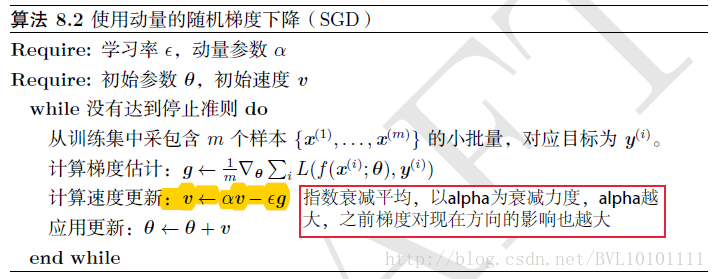
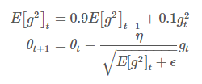
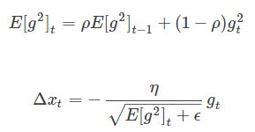
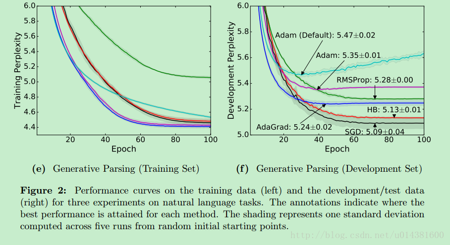

# 摘要
> 优化算法指通过改善训练方式，来最小化(或最大化)损失函数E(x)
---
# 局部最优问题
> 局部最优与鞍点。在神经网络中，最小化非凸误差函数的另一个关键挑战是避免陷于多个其他局部最小值中。实际上，问题并非源于局部极小值，而是来自鞍点，即一个维度向上倾斜且另一维度向下倾斜的点。这些鞍点通常被相同误差值的平面所包围，这使得SGD算法很难脱离出来，因为梯度在所有维度上接近于零。

# batch优化
> 很难选择出合适的学习率。太小的学习率会导致网络收敛过于缓慢，而学习率太大可能会影响收敛，并导致损失函数在最小值上波动，甚至出现梯度发散。
2.此外，相同的学习率并不适用于所有的参数更新。如果训练集数据很稀疏，且特征频率非常不同，则不应该将其全部更新到相同的程度，但是对于很少出现的特征，应使用更大的更新率。

## 随机梯度下降
> 对每个训练样本进行参数更新，每次执行都进行一次更新，且执行速度更快。
频繁的更新使得参数间具有高方差，损失函数会以不同的强度波动。这实际上是一件好事，因为它有助于我们发现新的和可能更优的局部最小值，而标准梯度下降将只会收敛到某个局部最优值。
但SGD的问题是，由于频繁的更新和波动，最终将收敛到最小限度，并会因波动频繁存在超调量。

## 批量梯度下降
> 传统的批量梯度下降将计算整个数据集梯度，但只会进行一次更新，因此在处理大型数据集时速度很慢且难以控制，甚至导致内存溢出。
权重更新的快慢是由学习率η决定的，并且可以在凸面误差曲面中收敛到全局最优值，在非凸曲面中可能趋于局部最优值。
使用标准形式的批量梯度下降还有一个问题，就是在训练大型数据集时存在冗余的权重更新。

## mini-batch梯度下降
> 听说GPU对2的幂次的batch可以发挥更佳的性能，因此设置成16、32、64、128...时往往要比设置为整10、整100的倍数时表现更优
显存估算，在每一个epoch计算完所有的样本后，计算下一代样本的时候，可以选择打乱所有样本顺序。

# 一阶优化
> 使用各参数的梯度值来最小化或最大化损失函数E(x)

# 学习率优化
> 全局调整
调整每一个需要优化的参数的学习率.
- 学习率衰减
> 每隔几个epoch减少一次learning rate, 一般是每运行5个epoch左右把learning rate减少一半, 或者是每隔20个epoch减少为原来的1/10.
线性衰减。例如：每过5个epochs学习率减半
指数衰减。例如：每过5个epochs将学习率乘以0.1 
> 指数加权平均

> 带修正的指数加权平均

- 动量梯度下降Momentum
> 给学习率增加了惯性

- NAG(Nesterov Momentum)
> Momentum由前面下降方向的一个累积和当前点的梯度方向组合而成.先按照历史梯度往前走那么一小步，按照前面一小步位置的“超前梯度”来做梯度合并

- AdaGrad
> 学习率 η 会随着每次迭代而根据历史梯度的变化而变化。
> 将每一个参数的每一次迭代的梯度取平方累加再开方，用基础学习率除以这个数，来做学习率的动态更新

>其学习率是单调递减的，训练后期学习率非常小
其需要手工设置一个全局的初始学习率
学习率的调整太激进, 因此常常过早结束了学习过程.
为每一个参数保留一个学习率以提升在稀疏梯度（即自然语言和计算机视觉问题）上的性能
- Rprop
- RMSprop
> 目前并没有发表, 基于权重梯度最近量级的均值为每一个参数适应性地保留学习率

- Adam
> 结合momentum和RMSprop

# 二阶优化
> 使用了二阶导数(也叫做Hessian方法)来最小化或最大化损失函数。由于二阶导数的计算成本很高，所以这种方法并没有广泛使用。
如果估计不好一阶导数，那么对二阶导数的估计会有更大的误差，这对于这些算法来说是致命的。对于二阶优化算法，减小batch换来的收敛速度提升远不如引入大量噪声导致的性能下降。在使用二阶优化算法时，往往要采用大batch
## 牛顿法
## 拟牛顿法
> 牛顿法有个缺点，海森矩阵是非稀疏矩阵，参数太多，其计算量太大。

- AdaDelta
> 通过设置窗口 w, 只使用部分时间的梯度累积.

- Hessian
## 其它
- 共轭梯度法
- 启发式优化
> 模拟退火方法、遗传算法、蚁群算法以及粒子群算法

# 总结
> [文章](doc\1705.08292.pdf)则是通过对比给出如下结论：自适应优化算法通常都会得到比SGD算法性能更差（经常是差很多）的结果，尽管自适应优化算法在训练时会表现的比较好，因此使用者在使用自适应优化算法时需要慎重考虑！

> 推荐使用Adam方法. Adam 算法通常会比 RMSProp 算法效果好. 另外,也可以尝试 SGD+Nesterov Momentum
---
参考资料
- [一文看懂各种神经网络优化算法：从梯度下降到Adam方法](http://www.sohu.com/a/149921578_610300)
- [神经网络优化算法综述](http://blog.csdn.net/young_gy/article/details/72633202)
- [谈谈深度学习中的 Batch_Size](http://blog.csdn.net/ycheng_sjtu/article/details/49804041)
- [深度机器学习中的batch的大小对学习效果有何影响？](https://www.zhihu.com/question/32673260)
- [自适应学习率调整：AdaDelta](https://www.cnblogs.com/neopenx/p/4768388.html)
- [卷积神经网络中的优化算法比较](http://shuokay.com/2016/06/11/optimization/)
- [Deep Learning 之 最优化方法](http://blog.csdn.net/BVL10101111/article/details/72614711)
- [卷积神经网络中的优化算法比较](http://shuokay.com/2016/06/11/optimization/)
- [教程 | 听说你了解深度学习最常用的学习算法：Adam优化算法？](http://www.sohu.com/a/156495506_465975)
